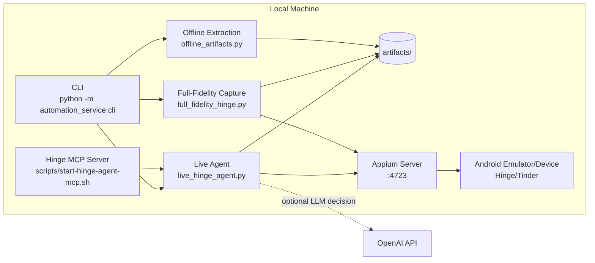
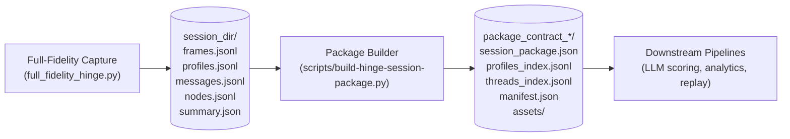
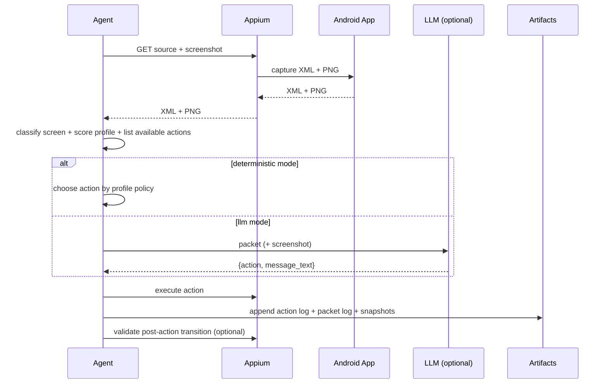
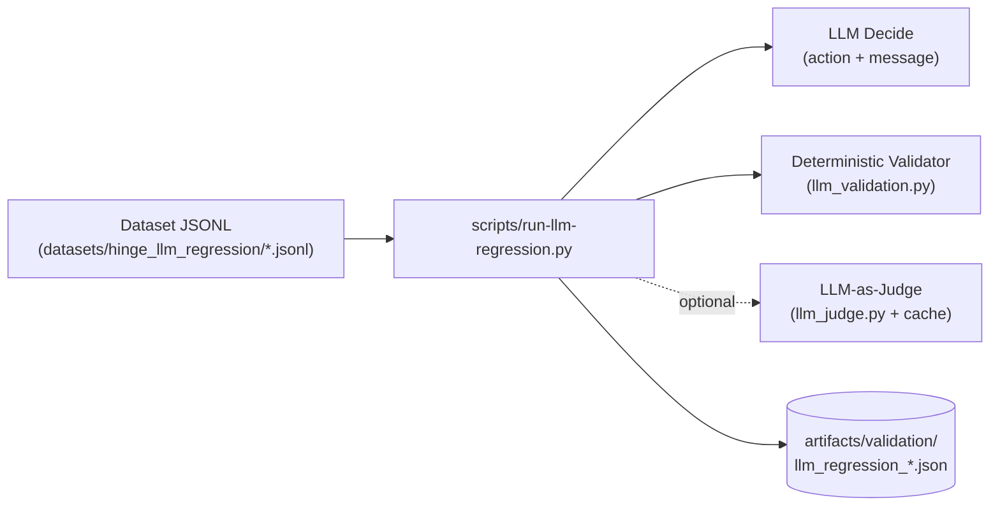

# Concierge (Appium-First)

Native mobile automation runtime for apps like Hinge and Tinder using Android + Appium.

This repository is now a **single methodology codebase**:

- one long-lived Appium session
- one observe -> decide -> act loop
- one artifact pipeline for offline analysis and replay

Legacy Playwright/browser automation and legacy context/persona microservices were removed.

## Architecture



### Full-Fidelity Packaging (Owned Contract)



## Decision Loop



## High-Signal Runtime Controls

Key config knobs (in `automation_service/mobile_examples/live_hinge_agent*.json`) that matter in real sessions:

- `target_package` and `target_activity`: identify the app surface we should control (`co.hinge.app/.ui.AppActivity`).
- `foreground_recovery`: when enabled, the live agent uses `adb shell am start` to bring Hinge back if Android drifts to launcher mid-run.
- `locators.overlay_close`: enables a dedicated high-level action `dismiss_overlay` for Rose sheets / paywalls.

## Quick Start

1. Create environment:

```bash
python3 -m venv venv
source venv/bin/activate
pip install -r requirements.txt
```

2. Start Android emulator:

```bash
./scripts/start-android-emulator.sh
```

3. Install Appium driver (first run only):

```bash
./scripts/install-appium-uiautomator2.sh
```

4. Start Appium server:

```bash
./scripts/start-appium-server.sh
```

5. Run CLI:

```bash
source venv/bin/activate
python -m automation_service.cli
```

## CLI Surface

`python -m automation_service.cli` exposes only mobile operations:

1. smoke test (screenshot + XML)
2. accessibility dump
3. UI XML locator search
4. interactive Appium console
5. scripted JSON routine
6. app-specific vertical inbox probe
7. declarative spec runner
8. offline artifact extraction
9. live Hinge agent
10. full-fidelity Hinge capture

## MCP Control Plane

Start MCP server:

```bash
./scripts/start-hinge-agent-mcp.sh
```

Tool docs:

- `docs/hinge-mcp-tools.md`
- `skills/hinge-autonomous-control/SKILL.md`

The MCP surface supports both:

- high-level autonomous control (`observe`, `decide`, `step`, `execute`)
- low-level operator control (`find_elements`, `click_element`, `type_into_element`, `tap_point`, `swipe_points`, `press_keycode`, `get_page_source`, `capture_screenshot`)

## Core Workflows

### 1) Deterministic validation run

```bash
source venv/bin/activate
python - <<'PY'
from automation_service.mobile.spec_runner import run_mobile_spec
run_mobile_spec(
    spec_json_path="automation_service/mobile_examples/hinge_deterministic_tabs.example.json"
)
PY
```

### 2) Autonomous live agent (deterministic or LLM)

Deterministic:

```bash
source venv/bin/activate
python - <<'PY'
from automation_service.mobile.live_hinge_agent import run_live_hinge_agent
run_live_hinge_agent(
    config_json_path="automation_service/mobile_examples/live_hinge_agent.example.json"
)
PY
```

LLM:

```bash
source venv/bin/activate
export OPENAI_API_KEY=...
python - <<'PY'
from automation_service.mobile.live_hinge_agent import run_live_hinge_agent
run_live_hinge_agent(
    config_json_path="automation_service/mobile_examples/live_hinge_agent.llm.example.json"
)
PY
```

### 3) Full-fidelity capture for downstream pipelines

```bash
source venv/bin/activate
python - <<'PY'
from automation_service.mobile.full_fidelity_hinge import run_hinge_full_fidelity_capture
run_hinge_full_fidelity_capture(
    config_json_path="automation_service/mobile_examples/hinge_full_fidelity_capture.example.json"
)
PY
```

### 4) Offline dataset extraction from artifacts

```bash
source venv/bin/activate
python - <<'PY'
from automation_service.mobile.offline_artifacts import run_offline_artifact_extraction
run_offline_artifact_extraction(
    config_json_path="automation_service/mobile_examples/offline_artifact_extract.hinge.example.json"
)
PY
```

### 5) Control contract validation (no emulator required)

Runs a simulated Appium contract test that validates:

- high-level Hinge action coverage
- Discover like/comment/send flow behavior
- Overlay handling (`dismiss_overlay`) when `locators.overlay_close` is provided
- low-level MCP control primitives (find/click/type/tap/swipe/keycode/source/screenshot)

```bash
source venv/bin/activate
python scripts/validate-hinge-control-contract.py
```

### 6) Live MCP stress probe (real device/session)

Exercises both MCP high-level and low-level controls against the active Hinge surface:

```bash
source venv/bin/activate
python scripts/stress-test-hinge-mcp-live.py \
  --config automation_service/mobile_examples/live_hinge_agent.example.json \
  --steps 4 \
  --mode deterministic \
  --live
```

### 7) Real-world live agent stress suite

Uses a no-messages-tolerant suite (works even when Messages has no thread responses yet):

```bash
source venv/bin/activate
export OPENAI_API_KEY=...
python scripts/stress-test-live-hinge-agent.py \
  --base-config automation_service/mobile_examples/live_hinge_agent.example.json \
  --suite-config automation_service/mobile_examples/live_hinge_stress_suite.realworld.example.json
```

Note:
- If LLM calls hit quota/rate limits, `llm_failure_mode=fallback_deterministic` keeps runs moving and logs the fallback reason.

### 8) Targeted live Discover comment-like probe

For validating "Like with comment" behavior directly:

```bash
source venv/bin/activate
python - <<'PY'
from automation_service.mobile.live_hinge_agent import run_live_hinge_agent
run_live_hinge_agent(
    config_json_path="automation_service/mobile_examples/live_hinge_agent.live_comment_probe.example.json"
)
PY
```

### 9) Package full-fidelity session into owned contract

Build a portable structured package from a full-fidelity capture session:

```bash
source venv/bin/activate
python scripts/build-hinge-session-package.py \
  --summary-json artifacts/full_fidelity_hinge/<session>/summary.json \
  --copy-assets
```

Outputs:
- `session_package.json` (contract payload)
- `profiles_index.jsonl`
- `threads_index.jsonl`
- `manifest.json`
- copied `assets/` (optional)

### 10) LLM Validation Suite (live + offline)

This suite is designed to validate:
- LLM calls are actually being made (no silent fallback)
- output is structurally valid (action in `available_actions`, message constraints)
- optional A/B: with screenshot vs without screenshot
- `llm_trace` observability (latency + token usage) is present in action logs for auditability

Live probe (dry run, 1 step) plus MCP probe:

```bash
source venv/bin/activate
adb shell am start -n co.hinge.app/.ui.AppActivity
python scripts/validate-llm-suite.py \
  --config automation_service/mobile_examples/live_hinge_agent.llm.example.json \
  --live \
  --live-steps 1 \
  --mcp-probe
```

Offline evaluation against a captured action log:

```bash
source venv/bin/activate
python scripts/validate-llm-suite.py \
  --config automation_service/mobile_examples/live_hinge_agent.llm.example.json \
  --offline-action-log artifacts/live_hinge_llm/<action_log>.json \
  --offline-max-rows 6 \
  --offline-repeat 2 \
  --ablate-screenshot
```

Synthetic suite (no Appium needed; exercises message generation, overlay recovery, and injection resistance):

```bash
source venv/bin/activate
python scripts/validate-llm-suite.py \
  --config automation_service/mobile_examples/live_hinge_agent.llm.example.json \
  --synthetic
```

Session package contract check:

```bash
source venv/bin/activate
python scripts/validate-llm-suite.py \
  --config automation_service/mobile_examples/live_hinge_agent.llm.example.json \
  --session-package artifacts/full_fidelity_hinge/<session>/package_contract_*/session_package.json
```

### 11) System Validation Suite (one command)

Aggregate runner that can execute a selection of:
- hinge control contract
- LLM synthetic suite
- offline regression dataset suite (no device)
- long-horizon rollout simulation (no device)
- live LLM probe + MCP probe
- live stress suite
- session-package contract check

Example (runs contract + synthetic + live probe):

```bash
source venv/bin/activate
adb shell am start -n co.hinge.app/.ui.AppActivity
python scripts/validate-system-suite.py --run-synthetic --run-live --live-steps 1
```

### 12) Offline Regression + Drift Detection (nightly-friendly)

This is the "snapshot testing" lane: run the LLM on a fixed dataset of packets and validate:

- output constraints (our deterministic validator)
- expected action sets per case
- optional baseline drift detection (action/message deltas)
- optional LLM-as-judge scoring with caching/budgets (tolerant acceptance)



Run the built-in synthetic regression dataset:

```bash
source venv/bin/activate
export OPENAI_API_KEY=...
python scripts/run-llm-regression.py \
  --dataset datasets/hinge_llm_regression/cases.synthetic.v1.jsonl \
  --include-screenshot
```

Generate a baseline snapshot (optional):

```bash
source venv/bin/activate
export OPENAI_API_KEY=...
python scripts/run-llm-regression.py \
  --dataset datasets/hinge_llm_regression/cases.synthetic.v1.jsonl \
  --include-screenshot \
  --temperature 0 \
  --write-baseline datasets/hinge_llm_regression/baselines/baseline_gpt-4.1-mini.jsonl
```

Compare against a baseline (drift detection):

```bash
source venv/bin/activate
export OPENAI_API_KEY=...
python scripts/run-llm-regression.py \
  --dataset datasets/hinge_llm_regression/cases.synthetic.v1.jsonl \
  --include-screenshot \
  --temperature 0 \
  --baseline datasets/hinge_llm_regression/baselines/baseline_gpt-4.1-mini.jsonl
```

Build a local (private) regression dataset from a real live run:

```bash
source venv/bin/activate
python scripts/build-llm-regression-dataset.py \
  --action-log artifacts/live_hinge_agent/<action_log>.json \
  --profile-json automation_service/mobile_examples/hinge_agent_profile.example.json \
  --copy-screenshots
```

### 13) Long-Horizon Rollout Simulation (multi-step)

This suite validates that the LLM can handle multi-step tasks (overlay recovery, navigation, then message/like),
without a device by simulating a state machine of Hinge screens.

```bash
source venv/bin/activate
export OPENAI_API_KEY=...
python scripts/validate-long-horizon.py \
  --scenarios datasets/hinge_rollouts/scenarios.synthetic.v1.json
```

## Repo Layout

- `automation_service/mobile/` -> Appium runtime, agent, capture, extraction modules.
- `automation_service/mobile_examples/` -> runnable JSON configs and example profiles.
- `datasets/` -> committed synthetic datasets (no PII) for regression + long-horizon simulation.
- `scripts/` -> emulator/Appium startup + benchmark/stress tooling.
- `docs/hinge-mcp-tools.md` -> MCP tool contract.
- `skills/hinge-autonomous-control/SKILL.md` -> operator workflow for agent control.
- `artifacts/` -> generated logs, screenshots, xml, datasets (gitignored).

## Environment Variables

Optional `.env` values:

- `APPIUM_SERVER_URL` (default `http://127.0.0.1:4723`)
- `APPIUM_PORT` (default `4723`)
- `ANDROID_SDK_ROOT`
- `ANDROID_HOME`
- `OPENAI_API_KEY` (required only for LLM decision mode)

## Make Targets

```bash
make help
```

Key targets:

- `make setup`
- `make emulator`
- `make appium-driver`
- `make appium`
- `make appium-mcp`
- `make hinge-mcp`
- `make cli`
- `make validate-control`
- `make validate-llm-synthetic`
- `make llm-regression`
- `make long-horizon`
- `make validate-system-synthetic`
