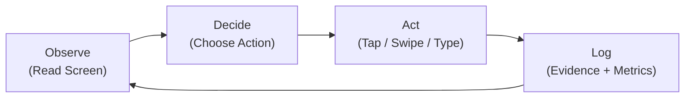
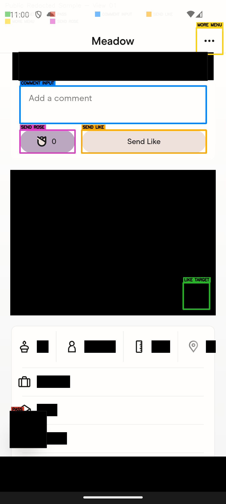
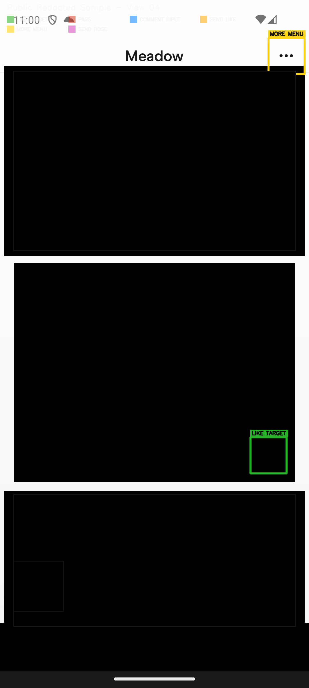
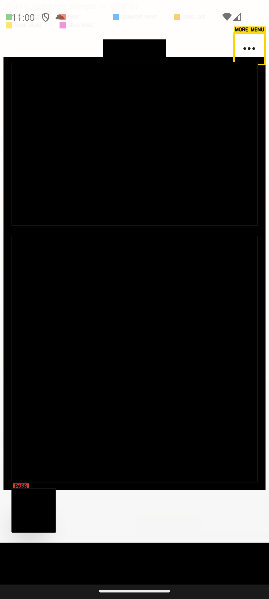

# Dating Agent

Autonomous mobile agent that can swipe on dating apps for you.

This project is focused on one thing: running a single live agent loop that can read the app screen, choose the next action, and execute it on your behalf.

## What It Does

The agent can:

- inspect the current profile screen in real time
- identify actionable controls (like, pass, comment, menu, send)
- choose a next step based on your preferences
- perform taps/swipes in the app
- record evidence so behavior is reviewable

In short: it automates the swipe workflow end to end.

## How It Works

The runtime is intentionally simple and unified.

1. Observe: capture the current UI state.
2. Decide: select the next action.
3. Act: execute that action in the app.
4. Log: store what happened for audit and tuning.

## Visual Walkthrough

These examples show the same live workflow with personal details hidden while actionable UI remains visible.

  

<em>Example A: the agent can see message controls and core actions on the current screen.</em>

  

<em>Example B: multiple valid actions can exist at once, and the agent selects one.</em>

  

<em>Example C: action selection stays consistent as the agent moves deeper in a profile.</em>

## Why This Matters

Most automation demos stop at clicking buttons.

This project focuses on decision quality under real app conditions:

- changing profile layouts
- repeated action opportunities
- limits and boundaries
- traceability after execution

That is the core value: not just interacting with the UI, but choosing sensible next actions repeatedly.

## Control & Boundaries

The agent is configurable so behavior is intentional, not random.

You can define:

- action limits (likes, passes, messages)
- messaging behavior and tone
- hard boundaries on what the agent should never do
- fallback behavior when model calls fail

## Privacy & Safety

This system works on real profile screens, so privacy handling is first-class.

- personal details in public examples are hidden
- every action can be reviewed through captured evidence
- users are expected to operate this responsibly and within platform rules

## Current Scope

- primary live support: Hinge agent loop
- broader mobile automation support: Android + Appium runtime
- additional app surfaces can be added through the same observe-decide-act model

---
