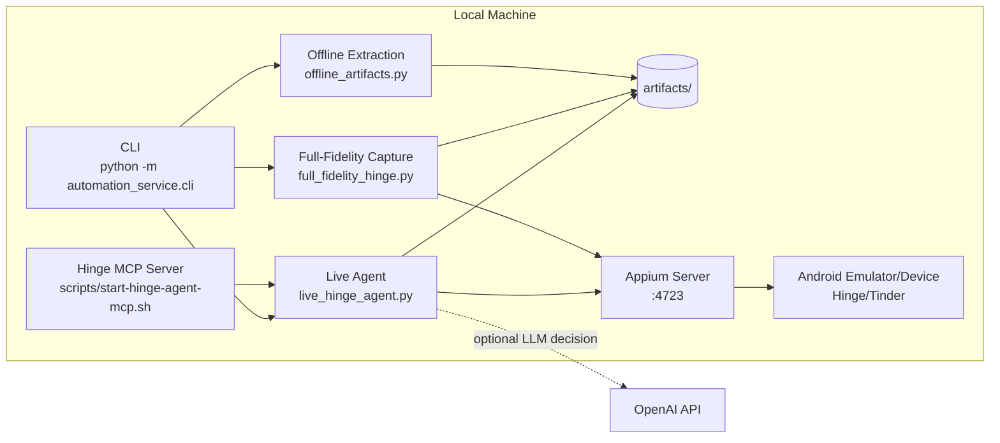
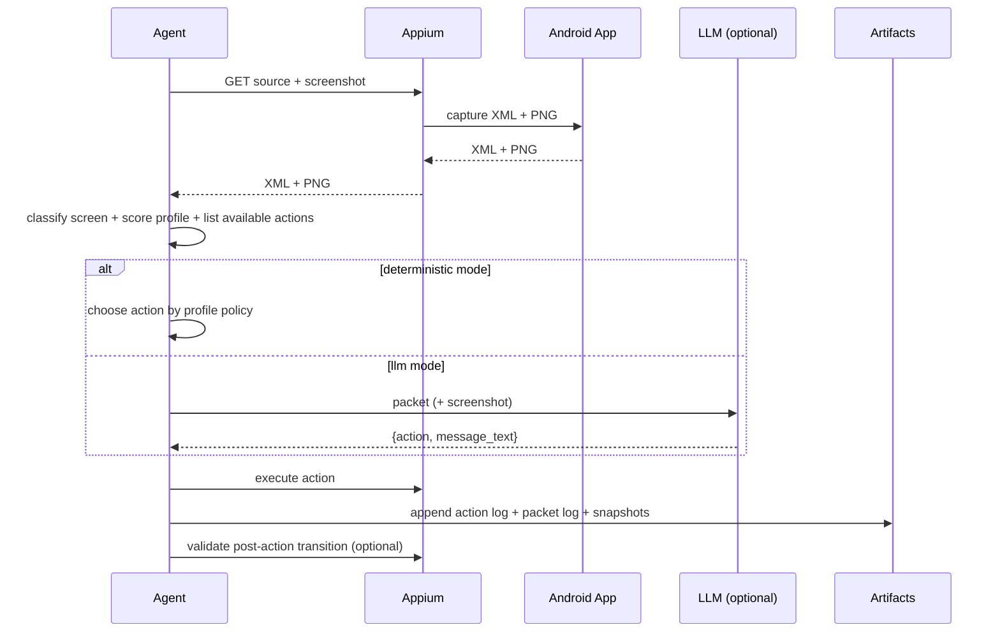

# Concierge (Appium-First)

Native mobile automation runtime for apps like Hinge and Tinder using Android + Appium.

This repository is now a **single methodology codebase**:

- one long-lived Appium session
- one observe -> decide -> act loop
- one artifact pipeline for offline analysis and replay

Legacy Playwright/browser automation and legacy context/persona microservices were removed.

## Architecture



## Decision Loop



## Quick Start

1. Create environment:

```bash
python3 -m venv venv
source venv/bin/activate
pip install -r requirements.txt
```

2. Start Android emulator:

```bash
./scripts/start-android-emulator.sh
```

3. Install Appium driver (first run only):

```bash
./scripts/install-appium-uiautomator2.sh
```

4. Start Appium server:

```bash
./scripts/start-appium-server.sh
```

5. Run CLI:

```bash
source venv/bin/activate
python -m automation_service.cli
```

## CLI Surface

`python -m automation_service.cli` exposes only mobile operations:

1. smoke test (screenshot + XML)
2. accessibility dump
3. UI XML locator search
4. interactive Appium console
5. scripted JSON routine
6. app-specific vertical inbox probe
7. declarative spec runner
8. offline artifact extraction
9. live Hinge agent
10. full-fidelity Hinge capture

## MCP Control Plane

Start MCP server:

```bash
./scripts/start-hinge-agent-mcp.sh
```

Tool docs:

- `docs/hinge-mcp-tools.md`
- `skills/hinge-autonomous-control/SKILL.md`

## Core Workflows

### 1) Deterministic validation run

```bash
source venv/bin/activate
python - <<'PY'
from automation_service.mobile.spec_runner import run_mobile_spec
run_mobile_spec(
    spec_json_path="automation_service/mobile_examples/hinge_deterministic_tabs.example.json"
)
PY
```

### 2) Autonomous live agent (deterministic or LLM)

Deterministic:

```bash
source venv/bin/activate
python - <<'PY'
from automation_service.mobile.live_hinge_agent import run_live_hinge_agent
run_live_hinge_agent(
    config_json_path="automation_service/mobile_examples/live_hinge_agent.example.json"
)
PY
```

LLM:

```bash
source venv/bin/activate
export OPENAI_API_KEY=...
python - <<'PY'
from automation_service.mobile.live_hinge_agent import run_live_hinge_agent
run_live_hinge_agent(
    config_json_path="automation_service/mobile_examples/live_hinge_agent.llm.example.json"
)
PY
```

### 3) Full-fidelity capture for downstream pipelines

```bash
source venv/bin/activate
python - <<'PY'
from automation_service.mobile.full_fidelity_hinge import run_hinge_full_fidelity_capture
run_hinge_full_fidelity_capture(
    config_json_path="automation_service/mobile_examples/hinge_full_fidelity_capture.example.json"
)
PY
```

### 4) Offline dataset extraction from artifacts

```bash
source venv/bin/activate
python - <<'PY'
from automation_service.mobile.offline_artifacts import run_offline_artifact_extraction
run_offline_artifact_extraction(
    config_json_path="automation_service/mobile_examples/offline_artifact_extract.hinge.example.json"
)
PY
```

## Repo Layout

- `automation_service/mobile/` -> Appium runtime, agent, capture, extraction modules.
- `automation_service/mobile_examples/` -> runnable JSON configs and example profiles.
- `scripts/` -> emulator/Appium startup + benchmark/stress tooling.
- `docs/hinge-mcp-tools.md` -> MCP tool contract.
- `skills/hinge-autonomous-control/SKILL.md` -> operator workflow for agent control.
- `artifacts/` -> generated logs, screenshots, xml, datasets (gitignored).

## Environment Variables

Optional `.env` values:

- `APPIUM_SERVER_URL` (default `http://127.0.0.1:4723`)
- `APPIUM_PORT` (default `4723`)
- `ANDROID_SDK_ROOT`
- `ANDROID_HOME`
- `OPENAI_API_KEY` (required only for LLM decision mode)

## Make Targets

```bash
make help
```

Key targets:

- `make setup`
- `make emulator`
- `make appium-driver`
- `make appium`
- `make appium-mcp`
- `make hinge-mcp`
- `make cli`
